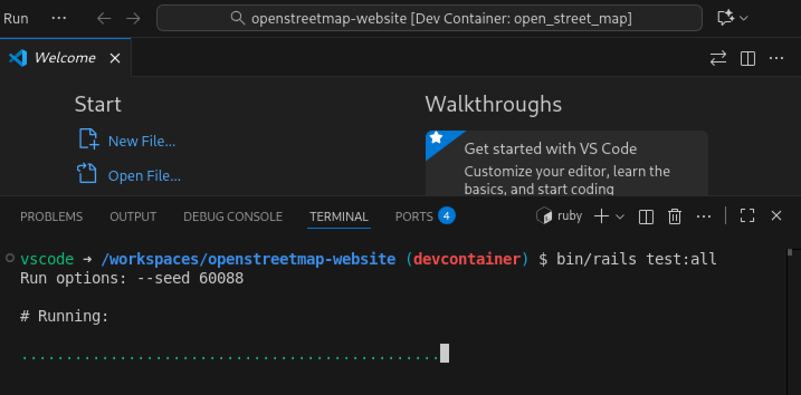
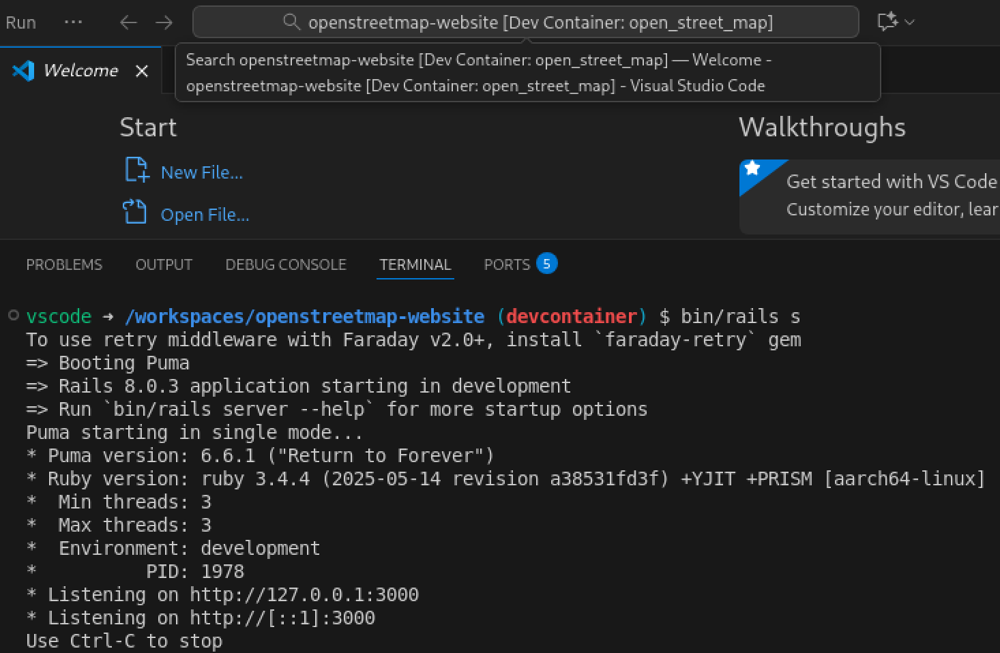

# Using Development Containers for development and testing

You can set up a development environment for this project using [Development Containers](https://containers.dev/), aka. devcontainers.

There are different ways of working with devcontainers, some are automated and integrated in IDE applications, while others are more manual and require CLI tools. This guide will use [Visual Studio Code](https://code.visualstudio.com) and assumes that it's installed already.

Be aware that the containers will take significant space in your hard drive, in the region of 6GB.

## Install Git

You will need Git to clone (download) the code repository and push changes. How to install Git will depend on your operating system.

### Ubuntu 24.04 LTS, Debian 13 (Trixie)

```bash
sudo apt-get update
sudo apt-get install git-core
```

### Fedora

```bash
sudo dnf install git
```

### macOS

For macOS, you will need [Xcode Command Line Tools](https://mac.install.guide/commandlinetools/); macOS 14 (Sonoma) or later; and some familiarity with Unix development via the Terminal.

### Windows

You can install Git using [WinGet](https://learn.microsoft.com/en-gb/windows/package-manager/winget/):

```bash
winget install --id Git.Git -e --source winget
```

Alternatively, see [other install options](https://git-scm.com/install/windows).

## Install Docker

Devcontainers run on top of Docker, which needs to be installed. Again, the methods will depend on your operating system.

In general: if you get an error about not having permission to use Docker, you may need to add your user to the `docker` group. The details vary, but often this is a case of running the following command:

```bash
sudo usermod --append --group docker $USERNAME
```

Where you must substitute `$USERNAME` with your actual username. After that, reboot your computer to ensure that this change takes effect.

### Windows

1. Use Docker Desktop via [docker.com Download](https://www.docker.com/products/docker-desktop/).

2. You have to enable git symlinks before cloning the repository.
   This repository uses symbolic links that are not enabled by default on Windows git. To enable them, [turn on Developer Mode](https://windowsreport.com/windows-11-developer-mode/) on Windows and run `git config --global core.symlinks true` to enable symlinks in Git. See [this StackOverflow question](https://stackoverflow.com/questions/5917249/git-symbolic-links-in-windows) for more information.

### Mac

- Use Docker Desktop via [docker.com Download](https://www.docker.com/products/docker-desktop/).
- Or [Homebrew](https://formulae.brew.sh/cask/docker).

### Linux

Use [Docker Engine](https://docs.docker.com/engine/install/ubuntu/) with the [docker-compose-plugin](https://docs.docker.com/compose/install/linux/)

## Clone the repository

The repository is reasonably large (~560MB) and it's unlikely that you'll need the full history. Therefore you can probably do with a shallow clone (~100MB):
```bash
git clone --depth=1 https://github.com/openstreetmap/openstreetmap-website.git
```

If you want to add in the full history later on, perhaps to run `git blame` or `git log`, run `git fetch --unshallow`.

> [!TIP]
> To download the full history from the start, run:
> ```bash
> git clone https://github.com/openstreetmap/openstreetmap-website.git
> ```

## Install Dev Containers extension

Start by opening the project with VS Code. Within it, you will need to install the extension _Dev Containers_, which can be done from the _Extensions_ section, reachable via the sidebar icons. Or VS Code may show a popup recommending this extension, with a button to install it directly.


## Open the project in a container

If everything is correct, this should make a few new commands available to you within VS Code. Find and run the command "Dev Containers: Reopen in Container".


The first time you do this, it will go into a bit of a process. It will create the devcontainer, pull the Docker images, install the dependencies, etc. Go drink some water while this runs.


Eventually this will present you with a development environment ready to go. In subsequent occasions this should be much faster.

## Done!

If everything went well, you are done! For example, now you can open a shell in this environment using the VS Studio command "Create New Terminal (With Profile)":


From this terminal, you can run the test suite with `bundle exec rails test:all`:



Hopefully it should be all green? 🤞 You can also start a development server with `bundle exec rails s`:



It will take a moment to start, after which you will be able to take a browser to http://localhost:3000 and visit your own local version of the site.

## Other useful configuration

See [`CONFIGURE.md`](CONFIGURE.md) for information on how to manage users and enable OAuth for iD, JOSM etc.

## Other tools

VS Code is not the only way to work with devcontainers. Other options include:

- [RubyMine](https://www.jetbrains.com/help/ruby/start-dev-container-inside-ide.html): another popular environment to work with Ruby.
- [DevPod](https://devpod.sh): a CLI tool to work with devcontainers.
- [VSCodium](https://vscodium.com): a Free/Libre alternative to VS Code.

## Troubleshooting

### `‘ruby’: No such file or directory`

In some cases Ruby may not install correctly. If you see this message, run these two commands:

```
mise install
bundle install
```

This has been observed particularly when using RubyMine.
