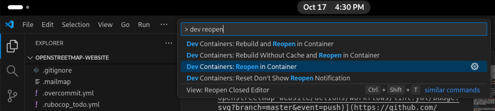
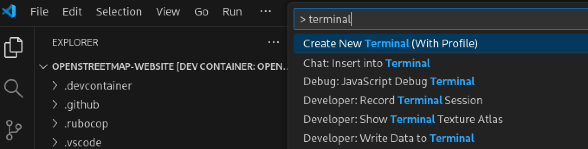
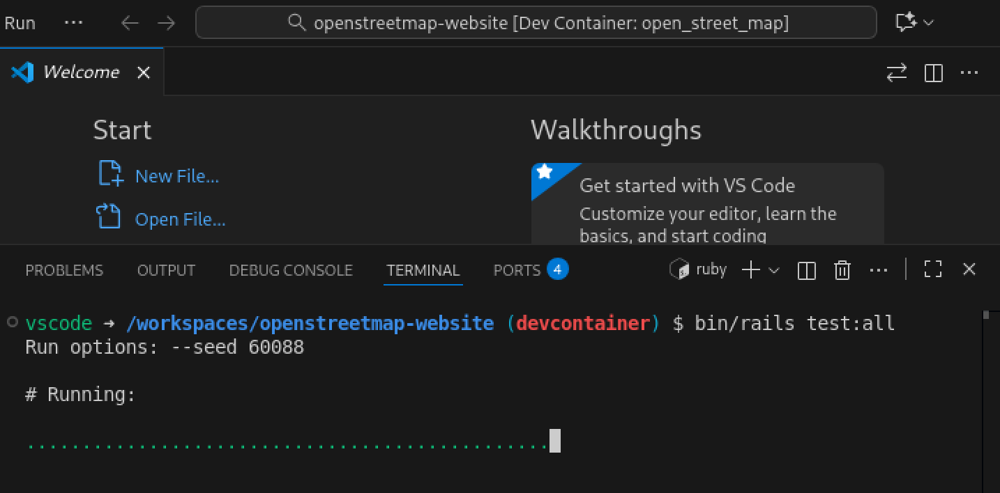

# Using Development Containers for development and testing

You can set up a development environment for this project using [Development Containers](https://containers.dev/), aka devcontainers.

There are different ways of working with devcontainers. Some are automated and integrated in IDE applications, while others are more manual and require CLI tools. This guide will use [Visual Studio Code](https://code.visualstudio.com) and assumes that it's installed already.

Be aware that the containers will take significant space in your hard drive, in the region of 6GB.

## Install Git

You will need Git to clone (download) the code repository and push changes. How to install Git will depend on your operating system.

### Ubuntu 24.04 LTS, Debian 13 (Trixie)

```bash
sudo apt-get update
sudo apt-get install git-core
```

### Fedora

```bash
sudo dnf install git
```

### macOS

For macOS, you will need [Xcode Command Line Tools](https://mac.install.guide/commandlinetools/); macOS 14 (Sonoma) or later; and some familiarity with Unix development via the Terminal.

### Windows

You can install Git using [WinGet](https://learn.microsoft.com/en-gb/windows/package-manager/winget/):

```bash
winget install --id Git.Git -e --source winget
```

Alternatively, see [other install options](https://git-scm.com/install/windows).

## Install Docker

You will need to install Docker in order to run devcontainers. Again, the methods will depend on your operating system.

In general: if you get an error about not having permission to use Docker, you may need to add your user to the `docker` group. The details vary, but often this is a case of running the following command:

```bash
sudo usermod --append --group docker $USERNAME
```

Substitute `$USERNAME` with your actual username in the command above. After that, reboot your computer to ensure that this change takes effect.

### Windows

1. Use Docker Desktop via [docker.com Download](https://www.docker.com/products/docker-desktop/).

2. You have to enable git symlinks before cloning the repository.
   This repository uses symbolic links that are not enabled by default on Windows git. To enable them, [turn on Developer Mode](https://windowsreport.com/windows-11-developer-mode/) on Windows and run `git config --global core.symlinks true` to enable symlinks in Git. See [this StackOverflow question](https://stackoverflow.com/questions/5917249/git-symbolic-links-in-windows) for more information.

### Mac

- Use Docker Desktop via [docker.com Download](https://www.docker.com/products/docker-desktop/).
- Or [Homebrew](https://formulae.brew.sh/cask/docker).

### Linux

Use [Docker Engine](https://docs.docker.com/engine/install/ubuntu/) with the [docker-compose-plugin](https://docs.docker.com/compose/install/linux/)

## Clone the repository

The repository is reasonably large (~560MB) and it's unlikely that you'll need the full history. Therefore you can probably do with a shallow clone (~100MB):
```bash
git clone --depth=1 https://github.com/openstreetmap/openstreetmap-website.git
```

If you want to add in the full history later on, perhaps to run `git blame` or `git log`, run `git fetch --unshallow`.

> [!TIP]
> To download the full history from the start, run:
> ```bash
> git clone https://github.com/openstreetmap/openstreetmap-website.git
> ```

## Install Dev Containers extension

Start by opening the project with VS Code. Within it, you will need to install the extension _Dev Containers_, which can be done from the _Extensions_ section, reachable via the sidebar icons. Or VS Code may show a popup recommending this extension, with a button to install it directly.


## Open the project in a container

If everything is correct, this should make a few new commands available to you within VS Code. Find and run the command "Dev Containers: Reopen in Container".



The first time you do this, it will go into a bit of a process. It will create the devcontainer, pull the Docker images, install the dependencies, etc. Go drink some water while this runs.


Eventually this will present you with a development environment ready to go. In subsequent occasions this should be much faster.

## Done!

If everything went well, you are done! For example, now you can open a shell in this environment using the VS Studio command "Create New Terminal (With Profile)":



From this terminal, you can run the test suite with `bundle exec rails test:all`:



Hopefully it should be all green? 🤞 You can also start a development server with `bundle exec rails s`:


It will take a moment to start, after which you will be able to take a browser to http://localhost:3000 and visit your own local version of the site.

> [!NOTE]
> The OSM map tiles you see aren't created from your local database - they are the production map tiles, served from a separate service over the Internet.

## What's next?

🎉 **Congratulations!** You have successfully installed the OpenStreetMap website.

**Next steps:**
* **Configuration:** See [CONFIGURE.md](CONFIGURE.md) for populating the database with data, creating users, setting up OAuth, and other configuration tasks.
* **Contributing:** Check out [CONTRIBUTING.md](../CONTRIBUTING.md) for coding style guidelines, testing procedures, and how to submit your contributions.

Any terminal commands must be run like above, in the terminal provided by VS Code to run within the devcontainer.

## Other tools

VS Code is not the only way to work with devcontainers. Other options include:

- [RubyMine](https://www.jetbrains.com/help/ruby/start-dev-container-inside-ide.html): another popular environment to work with Ruby.
- [DevPod](https://devpod.sh): a CLI tool to work with devcontainers.
- [VSCodium](https://vscodium.com): a Free/Libre alternative to VS Code.
- [GitHub Codespaces](https://github.com/codespaces): GitHub's hosted IDE.

## Troubleshooting

### `‘ruby’: No such file or directory`

In some cases Ruby may not install correctly. If you see this message, run these two commands:

```
mise install
bundle install
```

This has been observed particularly when using RubyMine.
